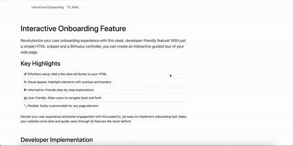

# GuidedTour

A simple Stimulus controller and a helper that enables you to show a guided tour overlay on your website. It requires Bootstrap to be installed and have Popover loaded.

This gem comes with the npm package [@itsbede/guided-tour](https://www.npmjs.com/package/@itsbede/guided-tour) ([package repo](https://github.com/its-bede/guided-tour-package)) that is installed and included into your apps `app/javascript/controller/application.js` by running the installer.

## Demo



## Requirements

This gem is built for Rails apps (>= 7.1) using stimulus and esbuild (with jsbundling).

## Installation

1. Add to your Gemfile:
    ```ruby
    gem 'guided_tour'
    ```
2. Run installer
    ```bash
      ./bin/rails g guided_tour:install
    ```
   
## Usage
In your view
```html
<!-- this is the example markup of you page that you want to guide the user through -->
<ul>
  <li id="foo">Foo</li>
  <li id="bar">Bar</li>
  <li id="baz">Baz</li>
</ul>

<!-- this is the gems helper code --> 
<%= guide_through(t('home.guide')) %>

<!-- if you like to go hardcoded you can hand in the map directly -->
<%= guide_through(
    { foo: "This is explanation for the element with the html id foo",
      bar: "This is explanation for the element with the html id bar",
      baz: "This is explanation for the element with the html id baz" }
) %>
```

In your locale .yml
```yaml
# config/locales/en.yml
---
en:
  # ...
  home:
    guide:
      foo: This is explanation for the element with the html id foo
      bar: This is explanation for the element with the html id bar
      baz: This is explanation for the element with the html id baz
  # ...
```

## Customization

### Texts

You can customize the header and the navigation buttons of the popover by defining this keys in your locale .yml

```yaml
en:
  guided-tour:
    next-btn-text: "Your custom Next button text"
    prev-btn-text: "Your custom Back button text"
    done-btn-text: "Your custom Done button text"
    step-line: "Step {{current}} of {{total}}"

de:
  guided-tour:
    next-btn-text: "Weiter"
    prev-btn-text: "Zurück"
    done-btn-text: "Fertig"
    step-line: "Erklärung {{current}} von {{total}}"
```

Make sure to include `{{current}}` and `{{total}}` in your `step-line` key to have the progress of the tour shown.

### Styles

This is the default styling from the package that is inserted into the pages `<head></head>`.

```css 
    .guided-tour--overlay {
        box-shadow: rgb(233 77 77 / 80%) 0 0 1px 2px,
        rgb(84 84 84 / 50%) 0 0 0 5000px;
        box-sizing: content-box;
        position: absolute;
        border-radius: 4px;
        transition: all .3s ease-out;
        z-index: 9998;
        pointer-events: none;
        opacity: 0;
    }

    .guided-tour--starter-btn-wrapper {
      position: absolute;
      right: 1rem;
      bottom: 1rem;
      animation: slideFromRight 1.2s cubic-bezier(0.23, 1, 0.32, 1) forwards;
      animation-delay: 1s;
      /* Ensures button is hidden before animation starts */
      opacity: 0;
      /* Improve animation performance */
      will-change: transform, opacity;

      > .btn {
        /* Prevent any layout shifts during animation */
        transform-origin: right center;
        z-index: 1000; /* Ensure button stays above other content */
      }
    }

    .guided-tour--overlay.active {
        opacity: 1;
    }

    .guided-tour--popover {
        z-index: 9999;
        max-width: 33.3%;
    }
```

You can override the default styles by using these CSS classes. Keep in mind that this package is meant to be used with bootstrap.

## License

The gem is available as open source under the terms of the [MIT License](https://opensource.org/licenses/MIT).
